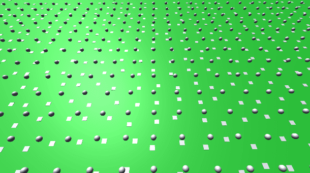
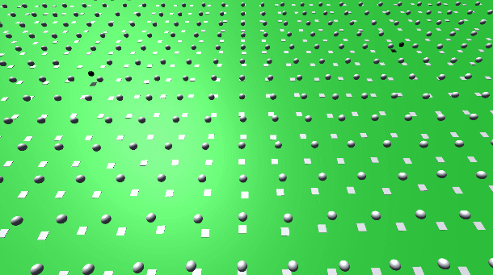

## EasyGeneticAlgorithm

简单的遗传算法的实现

在Sample中，有一个接球的小平板，以球和平板的位置作为输入，经过神经网络计算，输出平板移动的方向和距离，做出反馈。神经网络通过遗传算法迭代。

训练刚开始时：

进化500+代之后：

---

A simple implementation of genetic algorithm.

In sample case, there is a small plate that ricochet the ball, and the plate moves according to the result of position and speed of the ball and the plate.

In sample case, there is a small plate that is trying to ricochet the ball. The position of the ball and the plate are used as input, and the neural network calculates and outputs the direction and distance the plate moves as feedback. The neural network is iterated by genetic algorithm.

At the beginning of training:

After 500+ generations of evolution:

